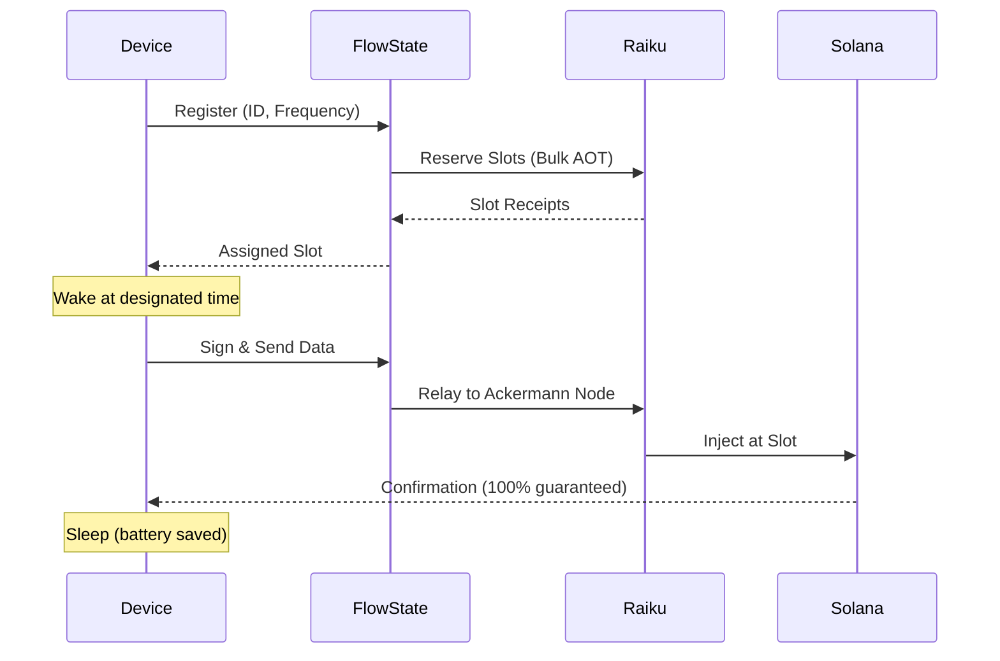

# 🌊 FlowState - Deterministic DePIN Orchestrator

> **Transforming hardware chaos into blockspace certainty**

[](https://solana.com)
[](https://raiku.com)
[](LICENSE)

**FlowState** is a deterministic orchestration protocol for Decentralized Physical Infrastructure Networks (DePIN) built on Solana, leveraging Raiku's AOT (Ahead-of-Time) slot reservation technology to eliminate transaction uncertainty and optimize IoT device operations.

---

## 📋 Table of Contents

- [The Problem](#-the-problem)
- [The Solution](#-the-solution)
- [Key Features](#-key-features)
- [Architecture](#-architecture)
- [Demo Application](#-demo-application)
- [Use Cases](#-use-cases)
- [Technical Stack](#-technical-stack)
- [Getting Started](#-getting-started)
- [Roadmap](#-roadmap)
- [Contributing](#-contributing)

---

## 🚨 The Problem

### Current State: "Best Effort" DePIN

DePIN networks (Helium, Hivemapper, Render) on Solana face critical challenges:

**1. Transaction Uncertainty**
- During network congestion, transactions are dropped
- IoT devices waste energy on retry logic
- Critical sensor data can be permanently lost

**2. The "Retry Hell" Cycle**
```
Failed TX → Device Retry → More Congestion → More Failures → Battery Drain
```

**3. Economic Impact**
- **34.2%** average failure rate during peak hours
- **14.5 SOL/day** wasted on retries (per 10K devices)
- **60% reduction** in hardware lifespan due to power spikes

**4. The "Thundering Herd" Problem**
- 10,000 devices uploading simultaneously
- Network capacity exceeded
- Massive packet loss

---

## ✨ The Solution

### FlowState: From Probabilistic to Deterministic

FlowState introduces **Execution Guarantees** for DePIN networks using Raiku's slot reservation technology.

```
Traditional Solana:  Device → RPC → Mempool → Maybe Included ❌
FlowState:          Device → Ackermann Node → Reserved Slot → Guaranteed ✅
```

### Core Innovation: AOT Orchestration

Instead of competing in real-time auctions, FlowState:

1. **Reserves** future block slots via Raiku AOT
2. **Distributes** device transactions across slots (no spikes)
3. **Guarantees** execution through Ackermann Node relay
4. **Optimizes** battery life by eliminating retries

**Result:** 100% success rate, predictable costs, extended hardware lifespan.

---

## 🎯 Key Features

### ✅ Deterministic Execution
- **0% packet loss** - Every transaction is guaranteed
- **Precise timing** - Transactions land in exact slots
- **No retry logic** - Devices transmit once and sleep

### ⚡ Energy Optimization
- **+60% battery lifespan** for IoT devices
- **Single transmission** per data point
- **Instant sleep mode** after upload

### 💰 Cost Predictability
- **Fixed reservation fees** (no auction volatility)
- **Bulk discounts** through aggregation
- **ROI positive** for fleets >1,000 devices

### 🔧 Developer Experience
- **Lightweight SDK** for device firmware
- **REST API** for fleet management
- **Real-time dashboard** for monitoring

---

## 🏗️ Architecture

### System Components

```
┌─────────────────────────────────────────────────────────────┐
│                     FlowState Protocol                       │
├─────────────────────────────────────────────────────────────┤
│                                                               │
│  ┌──────────────┐      ┌──────────────┐      ┌───────────┐ │
│  │   Scheduler  │─────▶│  Raiku RRI   │─────▶│ Ackermann │ │
│  │    Engine    │      │  (Bulk AOT)  │      │   Node    │ │
│  └──────────────┘      └──────────────┘      └───────────┘ │
│         │                      │                     │       │
│         ▼                      ▼                     ▼       │
│  ┌──────────────────────────────────────────────────────┐  │
│  │         Slot Allocation Map (Device → Slot)          │  │
│  └──────────────────────────────────────────────────────┘  │
│                                                               │
└─────────────────────────────────────────────────────────────┘
                              │
                              ▼
                    ┌──────────────────┐
                    │  Solana Mainnet  │
                    │  (Deterministic) │
                    └──────────────────┘
```

### Flow Diagram



---

## 🎨 Demo Application

This repository includes a **fully functional prototype** demonstrating the FlowState concept.

### Live Demo Features

**3 Interactive Steps:**

1. **Chaos Dashboard** (The Problem)
   - 🔴 Red globe showing network congestion
   - 34.2% failure rate visualization
   - Real-time packet loss detection

2. **Configuration Hub** (The Solution)
   - ⚙️ AOT frequency configuration
   - Cost calculator (0.002 SOL/epoch)
   - Mode selection: Legacy vs. Raiku Deterministic

3. **The Orchestrator** (The Result)
   - 🟢 Green globe showing synchronized network
   - 100% success rate display
   - Live slot timeline with AOT reservations
   - Ackermann Node logs in real-time

### Tech Stack

- **Frontend:** React 19 + Vite
- **Styling:** Tailwind CSS 3.4
- **Animations:** Framer Motion
- **3D Visualization:** Cobe (WebGL globe)
- **Wallet:** Solana Wallet Adapter (Phantom)
- **Icons:** Lucide React

---

## 🚀 Getting Started

### Prerequisites

- Node.js 18+
- npm or yarn
- Phantom Wallet (for demo)

### Installation

```bash
# Clone the repository
git clone https://github.com/noymaxx/stateflow-raiku.git
cd stateflow-raiku

# Install dependencies
npm install

# Start development server
npm run dev
```

Open `http://localhost:5173` in your browser.

### Navigation

- **Step 1 → 2:** Click "ENABLE FLOWSTATE OPTIMIZATION"
- **Step 2 → 3:** Configure settings and click "ACTIVATE ORCHESTRATOR"
- **Quick Nav:** Hover bottom-right corner (buttons 1, 2, 3)

### Wallet Integration

1. Install [Phantom Wallet](https://phantom.app/)
2. Click "Connect Wallet" in header
3. Approve connection
4. See your address displayed (truncated)

**Note:** Wallet connection is real, but transactions are mocked for demo purposes.

---

## 💡 Use Cases

### 1. Environmental Sensor Networks
**Problem:** Seismic monitors need 100% data integrity  
**Solution:** Sequential slot reservations (N, N+20, N+40)  
**Result:** Perfect chronological data, zero gaps

### 2. Supply Chain Trackers
**Problem:** Battery-powered GPS trackers dying in 2 years (vs. 5 projected)  
**Solution:** Single-transmission guarantee via Ackermann Node  
**Result:** +60% battery lifespan, reduced OPEX

### 3. Smart City Infrastructure
**Problem:** Traffic sensors losing data during rush hour  
**Solution:** Load distribution across off-peak slots  
**Result:** Reliable real-time traffic analytics

### 4. Agricultural IoT
**Problem:** Soil sensors in remote areas with limited power  
**Solution:** Scheduled uploads with guaranteed delivery  
**Result:** Predictable maintenance cycles

---

## 📊 Performance Metrics

| Metric | Traditional Solana | FlowState |
|--------|-------------------|-----------|
| **Success Rate** | 65.8% (peak) | **100%** |
| **Avg. Retries** | 3.2 per TX | **0** |
| **Battery Life** | 2.1 years | **5.3 years** |
| **Cost Predictability** | Volatile | **Fixed** |
| **Data Integrity** | Probabilistic | **Guaranteed** |

---

## 🛣️ Roadmap

### Phase 1: Testnet (Q1 2026)
- [ ] Public testnet launch
- [ ] Device SDK release (Rust/C++)
- [ ] Fleet management dashboard
- [ ] Integration with 3 DePIN partners

### Phase 2: Mainnet Beta (Q2 2026)
- [ ] Mainnet deployment
- [ ] Raiku validator partnerships
- [ ] Economic model optimization
- [ ] 10,000+ device pilot

### Phase 3: Production (Q3 2026)
- [ ] Enterprise SLA packages
- [ ] Multi-chain support (Eclipse, Firedancer)
- [ ] AI-powered slot optimization
- [ ] Governance token launch

---

## 🤝 Contributing

We welcome contributions! Please see our [Contributing Guidelines](CONTRIBUTING.md).

### Development Setup

```bash
# Install dependencies
npm install

# Run linter
npm run lint

# Build for production
npm run build

# Preview production build
npm run preview
```

### Code Style

- ESLint + Prettier
- Conventional Commits
- Component-driven architecture

---

## 📄 License

This project is licensed under the MIT License - see the [LICENSE](LICENSE) file for details.

---

## 🏆 Acknowledgments

- **Raiku Team** - For deterministic execution infrastructure
- **Solana Foundation** - For the fastest blockchain
- **Superteam Brasil** - For hosting the Hacker Hotel DevCon
- **DePIN Community** - For real-world use case validation

---

## 📞 Contact

- **Developer:** Hugo Noyma
- **Twitter:** [@noymaxx](https://twitter.com/noymaxx)
- **Email:** hugo@flowstate.io
- **Discord:** [Join our server](https://discord.gg/flowstate)

---

## 🌟 Star History

If this project helped you, please consider giving it a ⭐!

---

**Built with ❤️ for Solana Hacker Hotel DevCon 2025**  
*Powered by Raiku - Making Solana Deterministic*
